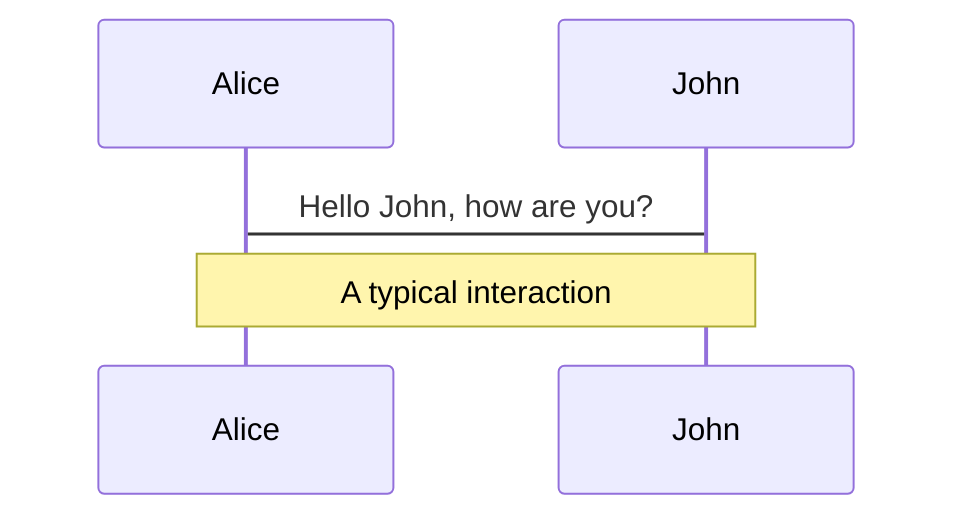
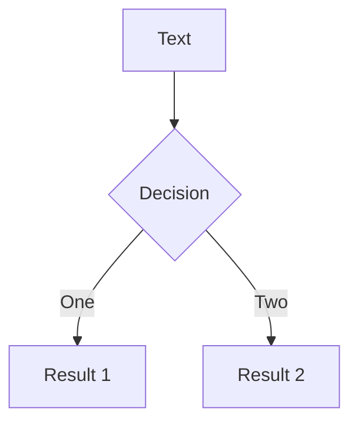
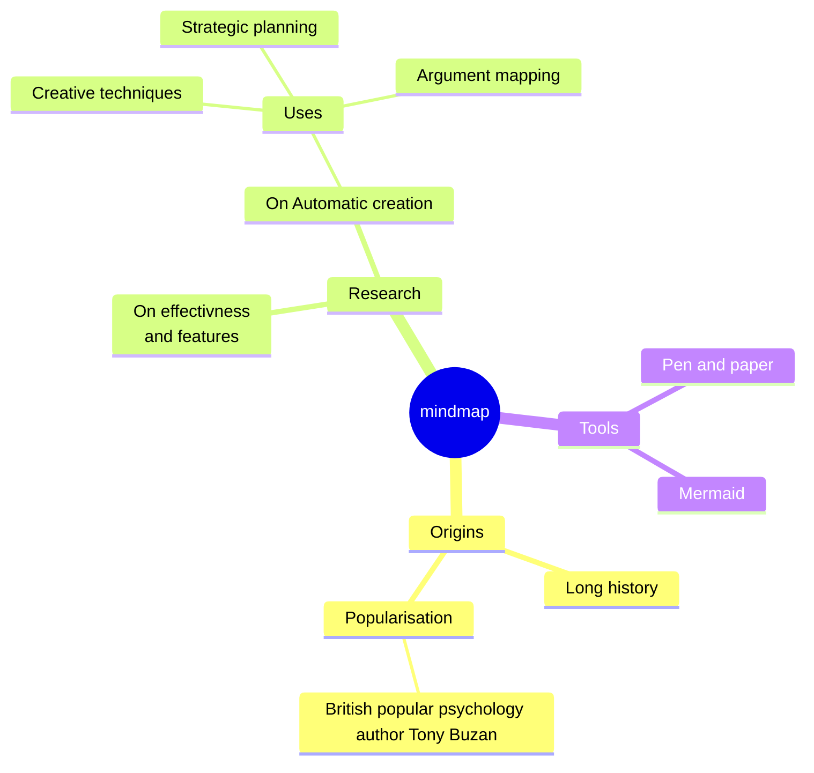
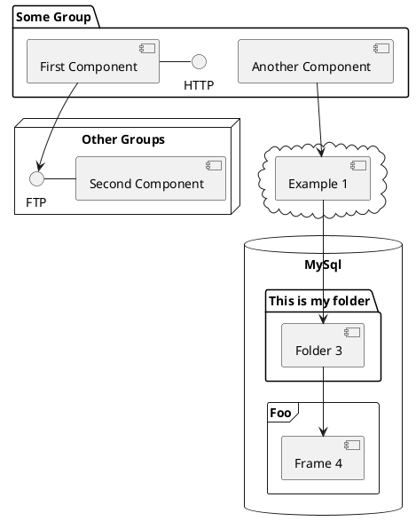

# Web Performance

Performance messen und verbessern

<div class="pt-12">
  <span @click="$slidev.nav.next" class="px-2 py-1 rounded cursor-pointer" hover="bg-white bg-opacity-10">
    Press Space for next page <carbon:arrow-right class="inline"/>
  </span>
</div>

<div class="abs-br m-6 flex gap-2">
Dominik Albrecht | 15.08.2023
</div>

<!--
Slide note
https://googlechrome.github.io/lighthouse/scorecalc/
https://developer.chrome.com/docs/lighthouse/performance/performance-scoring/?utm_source=lighthouse&utm_medium=lr
-->

---
transition: fade-out
hideInToc: true
---

# Why performance matters 


- 👩‍💼 **Usability** - Jegliches Warten auf einer Seite verschlechtert den Gesamteindruck
- 🚪 **Bounce** - Initial lange Wartezeiten fuehren zu einem Absprung
- 💰 **Conversion** Gerade bei WebShops zeigt sich, dass eine schlechte Performance auch die Konversationsrate negativ beeinflusst
- 🏆 **Image** - Kunden der Intesim erwarten unter Qualitaet auch eine gut performende Applikation
- 🤖 **SEO** - Schlechte Page-Metrics tragen zu einem verschlechtert Ranking bei Suchmaschine bei
- 📱 **Mobile** - Auch heute sind teils mobile Netze beschraenkt. Speed kann limitiert sein, oder teils kostet sogar der Datentransfer

<br>
<br>

Web Performance ist ein wichtiger Bestandteil einer qualitativ hochvertigen Loesung.
<!--
Notes
-->

<style>
h1 {
  background-color: #2B90B6;
  background-image: linear-gradient(45deg, #007ecc 10%, #146b8c 20%);
  background-size: 100%;
  -webkit-background-clip: text;
  -moz-background-clip: text;
  -webkit-text-fill-color: transparent;
  -moz-text-fill-color: transparent;
}
</style>

<!--
Here is another comment.
-->

---
layout: default
hideInToc: true
---

# Ueberblick

<ul>
<li>sfsfs</li>
<li>sfsfs</li>
<li>sfsfs</li>
<li>sfsfs</li>
<li class="dev">sfsfs</li>
<li class="dev">sfsfs</li>
<li class="dev">sfsfs</li>
<li class="dev">sfsfs</li>
</ul>

<div class="abs-br m-6 flex gap-2 dev">
Relevant primaer Entwickler
</div>

<style>
.dev {
  background-color: #2B90B6;
  background-image: linear-gradient(45deg, #007ecc 10%, #146b8c 20%);
  background-size: 100%;
  -webkit-background-clip: text;
  -moz-background-clip: text;
  -webkit-text-fill-color: transparent;
  -moz-text-fill-color: transparent;
}
</style>

---

# StatusQuo

Optimale Ergebnisse sind mit unserer aktuellen Arbeitsweise schwierig zu erzielen.


Ursachen davon sind:
- 🚪 **Bilder** - Initial lange Wartezeiten fuehren zu einem Absprung
- 🚪 **JS Bundles** - Initial lange Wartezeiten fuehren zu einem Absprung
- 🚪 **Server** - Initial lange Wartezeiten fuehren zu einem Absprung

---

# Projektvorgehen

Pro Projekt muss ein klares Ziel hinsichtlich Performance festgelegt werden. Dabei sind vorallem die Anwendungdzwecke ausschlaggebend.


---
transition: slide-up
layout: cover
---

# Metrics: Overview


---
transition: slide-up
---

# Metrics: Key-Metrics

Hover on the bottom-left corner to see the navigation's controls panel, [learn more](https://sli.dev/guide/navigation.html)

### Lighthouse Key-Metrics

|     |     |
| --- | --- |
| LCP| Generelle Ladezeit. Hauptinhalt fertig geladen |
| FID| Zeit bis ein Event auf einem InputElement abgeschlossen ist |
| CLS| Stabilitaet des Seitenaufbaus |
| FCP| Erste Elemente werden auf der Website dargestellt  |

---
layout: iframe

# the web page source
url: https://googlechrome.github.io/lighthouse/scorecalc/
---

# Tools - Scoring

---
layout: image-right
image: /ulh-side.png
---

# Tools - Unlighthouse

Unlighthouse zum kompletten Website Scan

```bash
npx unlighthouse --site https://mpk.ch
```

---

# Components

<div grid="~ cols-2 gap-4">
<div>

You can use Vue components directly inside your slides.

We have provided a few built-in components like `<Tweet/>` and `<Youtube/>` that you can use directly. And adding your custom components is also super easy.

```html
<Counter :count="10" />
```

<!-- ./components/Counter.vue -->
<Counter :count="10" m="t-4" />

Check out [the guides](https://sli.dev/builtin/components.html) for more.

</div>
<div>

```html
<Tweet id="1390115482657726468" />
```

<Tweet id="1390115482657726468" scale="0.65" />

</div>
</div>

<!--
Presenter note with **bold**, *italic*, and ~~striked~~ text.

Also, HTML elements are valid:
<div class="flex w-full">
  <span style="flex-grow: 1;">Left content</span>
  <span>Right content</span>
</div>
-->


---
class: px-20
---

# Themes

Slidev comes with powerful theming support. Themes can provide styles, layouts, components, or even configurations for tools. Switching between themes by just **one edit** in your frontmatter:

<div grid="~ cols-2 gap-2" m="-t-2">

```yaml
---
theme: default
---
```

```yaml
---
theme: seriph
---
```


</div>

Read more about [How to use a theme](https://sli.dev/themes/use.html) and
check out the [Awesome Themes Gallery](https://sli.dev/themes/gallery.html).

---
preload: false
---

# Animations

Animations are powered by [@vueuse/motion](https://motion.vueuse.org/).

```html
<div
  v-motion
  :initial="{ x: -80 }"
  :enter="{ x: 0 }">
  Slidev
</div>
```

<div class="w-60 relative mt-6">
  <div class="relative w-40 h-40">
    
    
    
  </div>

  <div
    class="text-5xl absolute top-14 left-40 text-[#2B90B6] -z-1"
    v-motion
    :initial="{ x: -80, opacity: 0}"
    :enter="{ x: 0, opacity: 1, transition: { delay: 2000, duration: 1000 } }">
    Slidev
  </div>
</div>

<!-- vue script setup scripts can be directly used in markdown, and will only affects current page -->
<script setup lang="ts">
const final = {
  x: 0,
  y: 0,
  rotate: 0,
  scale: 1,
  transition: {
    type: 'spring',
    damping: 10,
    stiffness: 20,
    mass: 2
  }
}
</script>

<div
  v-motion
  :initial="{ x:35, y: 40, opacity: 0}"
  :enter="{ y: 0, opacity: 1, transition: { delay: 3500 } }">

[Learn More](https://sli.dev/guide/animations.html#motion)

</div>

---

# LaTeX

LaTeX is supported out-of-box powered by [KaTeX](https://katex.org/).

<br>

Inline $\sqrt{3x-1}+(1+x)^2$

Block
$$
\begin{array}{c}

\nabla \times \vec{\mathbf{B}} -\, \frac1c\, \frac{\partial\vec{\mathbf{E}}}{\partial t} &
= \frac{4\pi}{c}\vec{\mathbf{j}}    \nabla \cdot \vec{\mathbf{E}} & = 4 \pi \rho \\

\nabla \times \vec{\mathbf{E}}\, +\, \frac1c\, \frac{\partial\vec{\mathbf{B}}}{\partial t} & = \vec{\mathbf{0}} \\

\nabla \cdot \vec{\mathbf{B}} & = 0

\end{array}
$$

<br>

[Learn more](https://sli.dev/guide/syntax#latex)

---

# Diagrams

You can create diagrams / graphs from textual descriptions, directly in your Markdown.

<div class="grid grid-cols-4 gap-5 pt-4 -mb-6">









</div>

[Learn More](https://sli.dev/guide/syntax.html#diagrams)

---
src: ./pages/multiple-entries.md
hide: false
---

---
layout: center
class: text-center
---

# Interne Links

[Testprozess](https://web.dev/metrics/) · [Blogartikel](https://unlighthouse.dev/) 

---
layout: fact
class: text-center
---

# Learn More

[Metrics by Google](https://web.dev/metrics/) · [LighthouseScore](https://googlechrome.github.io/lighthouse/scorecalc/) · [UnLighthouse](https://unlighthouse.dev/) · [WebVitals Ext](https://chrome.google.com/webstore/detail/web-vitals/ahfhijdlegdabablpippeagghigmibma)
